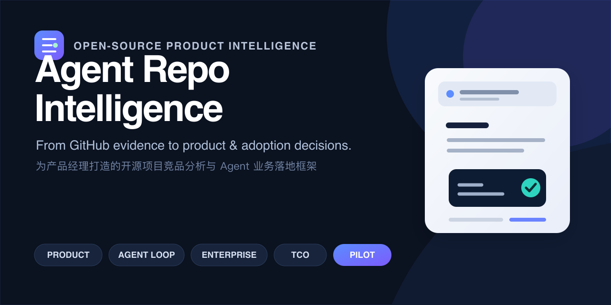

# Agent Repo Intelligence — GitHub 竞品分析 Skill for PMs

> Evidence-driven open-source product and AI Agent due diligence for product managers — from GitHub repository evidence to competitive insight, business adoption decisions, enterprise readiness, TCO, and measurable pilot plans.

**面向产品经理、Agent 产品经理和技术战略团队的开源项目竞品分析与业务落地决策 Skill。**

[](./LICENSE)
[](https://github.com/m2290526022-boop/agent-repo-intelligence/stargazers)



[中文介绍](#中文介绍) · [English Overview](#english-overview) · [Example Report](./reports/deepseek-harness/deepseek-harness-analysis.html) · [Skill Definition](./SKILL.md)

---

## 中文介绍

### 它解决什么问题

研究一个 GitHub 开源项目并不难。真正困难的是回答这些问题：

- 它究竟在为谁解决什么问题，而不只是包含哪些功能？
- README 的产品主张，有多少真的被代码、配置和测试支持？
- 对 Agent 项目而言，它的 Loop、Tool、Memory、Planning、权限、恢复和评测到底怎么工作？
- 架构看起来很先进，是否意味着适合真实业务使用？
- 如果一家互联网公司准备采用它，应该用在哪个场景、开放到什么自治等级？
- 选择 Adopt、Fork、Borrow、Build、Buy 还是不做，分别有什么代价？
- 如何设计 Pilot、评测指标、上线门槛、回滚和 Kill Criteria？

**Agent Repo Intelligence** 把普通的“开源项目总结”升级为一套证据驱动的产品研究、Agent 技术尽调和业务落地决策系统。

它不会因为项目 Star 很多就推断产品成功，也不会因为架构漂亮就建议进入生产。每个关键结论必须被标记为：

- **Verified / 已验证**：代码、测试、配置或一手资料直接支持；
- **Inferred / 推断**：多个信号支持，但仍需要验证；
- **Unknown / 未知**：证据不足，不强行下结论；
- **Conflicted / 冲突**：可信来源、版本或主张之间存在矛盾。

### 一句话定位

> 把 GitHub 仓库从“代码与功能列表”，转化为产品判断、Agent 机制、业务适配、生产风险和可执行试点方案。

### 适合谁

| 角色 | 可以用它做什么 |
|---|---|
| 产品经理 / PM | 快速理解开源项目的用户、价值闭环、产品边界和可借鉴机制 |
| Agent 产品经理 | 拆解 Agent Loop、工具、记忆、计划、权限、Human-in-the-loop 和评测体系 |
| 创业者 / Founder | 判断开源项目的产品机会、切入点、扩张路径和潜在壁垒 |
| 研发与架构负责人 | 把用户能力映射到运行路径、核心模块、状态、依赖和信任边界 |
| 研发效能 / Agent 平台团队 | 评估是否适合内部试点、共享平台或企业级生产环境 |
| 投资、战略与创新团队 | 做开源技术尽调、生态与治理分析、Build/Buy/Borrow 决策 |
| 求职者与面试候选人 | 产出有证据、有业务判断、有落地方案的高质量产品分析作品 |

## 它能分析什么

### 1. 产品与竞品分析

- 一句话产品定义、目标用户和 Job-to-be-Done
- 当前替代方案、最短价值路径和持续价值循环
- Onboarding、激活、失败体验和用户控制感
- 定位、分发、生态、商业化信号和结构性约束
- 多仓库标准化比较，而不是机械功能打勾

### 2. Agent 产品机制

- Agency Contract：目标来源、自治范围、完成与停止条件
- Runtime Loop：Observe → Plan → Act → Validate → Recover
- Model、Tool、Skill、MCP 和结构化输出边界
- Context、Working State、Session、Memory 与 Learning 的区别
- Planning、多 Agent、Workflow 和协作协议
- 审批、Sandbox、最小权限、审计和人工接管
- 重试、超时、部分副作用、回滚和失败恢复
- 任务质量、延迟、成本和可观测性

### 3. 能力到代码的映射

对核心能力追踪：

```text
用户动作
  → UI / CLI / API
  → Orchestration / Agent Runtime
  → State / Data
  → External Dependency
  → Result / Feedback / Recovery
```

这让产品判断能够追溯到实际代码，而不是停留在 README 和演示视频。

### 4. 真实业务采用决策

同一项目在不同业务场景中会得到不同结论。Skill 会按照以下维度建立场景：

```text
Actor + Workflow + Environment + Autonomy
+ Data Boundary + Failure Consequence + Scale
```

然后分别给出：

- `Adopt`：已有证据支持在明确边界内使用；
- `Prototype`：值得进行有指标、有期限的试点；
- `Watch`：等待特定成熟度或内部条件；
- `Reject`：与目标场景结构性不匹配，或被更简单方案支配。

### 5. 七道 Agent Readiness Gates

| Gate | 核心问题 |
|---|---|
| 业务价值 | 是否高频、高成本或高影响，并有可观测基线？ |
| Agent 适配 | 是否真的需要模型推理，而不是规则和传统自动化？ |
| 数据与工具 | 数据是否可用、可授权、可追溯；工具是否稳定、可取消、可测试？ |
| 可验证与停止 | 系统或人类能否判断完成、失败和禁止动作？ |
| 信任与控制 | 权限、审批、审计、回滚和人工接管是否成立？ |
| 可靠性与运营 | 重试、超时、恢复、版本、容量、成本和事故处理是否可控？ |
| 经济与组织 | 风险调整后的收益是否成立，长期责任人是否明确？ |

推荐自治等级由最弱的关键 Gate 决定，不会用多个优点抵消一个安全或责任硬门槛。

### 6. 企业生产就绪度

针对共享平台、外部客户和高风险业务，额外检查：

- SSO、RBAC、服务身份和授权生命周期
- Workspace、Tenant、Session、Memory 和数据隔离
- Secret、网络出口、工具与插件供应链
- 事件审计、数据留存、删除和可追溯性
- SLA、容量、监控、回滚、灾难恢复和事故响应
- 模型、Prompt、Tool、Policy 和 Plugin 的变更治理
- 许可证、采购、合规、支持和退出路径

### 7. TCO、ROI 与 Pilot

当业务输入足够时，Skill 可以生成 Downside / Base / Upside 三种情景，覆盖：

- 人工节省与质量价值
- 模型、检索、工具、存储和网络成本
- 人工审核与返工
- 集成、安全、评测、培训和维护
- 开源升级、Fork、漏洞响应和退出成本
- 严重错误与预期损失

当数据不足时，它会输出 Required Inputs 和 Break-even 问题，而不是生成虚假的 ROI。

试点按照以下阶段推进：

```text
Offline → Shadow → Assist → Supervised → Bounded Autonomy → Scale
```

每一阶段必须包含基线、任务集、指标、晋级条件、回滚和 Kill Criteria。

## 为什么它不只是一个 Prompt

| 普通仓库分析 | Agent Repo Intelligence |
|---|---|
| 总结 README 和功能 | 把产品主张追溯到代码、配置、测试和运行路径 |
| 给项目一个统一评分 | 根据业务场景分别决策 |
| 架构先进 = 值得采用 | 区分架构质量、业务适配和生产就绪度 |
| 罗列风险 | 给出决定性阻断项、责任人和最小验证 |
| 建议“做一个 MVP” | 定义业务基线、任务集、晋级门和 Kill Criteria |
| 粗略讨论成本 | 使用可复算的风险调整 TCO 情景 |
| 输出一篇文章 | 输出证据账本、JSON、SVG、HTML 和校验结果 |

项目内置：

- 证据与反证 Ledger
- 结构化 `project-knowledge.json`
- Business Adoption Case Validator
- TCO Scenario Calculator
- Capability Graph 与 Layered Architecture 生成器
- 无 CDN、可打印的离线 HTML 报告
- Decision Quality Rubric 和前向测试协议

如果你经常需要从开源项目中做产品判断、Agent 选型或竞品研究，可以 Star 本项目持续跟进案例、评测方法和企业落地框架。

## 示例：DeepSeek Harness

Golden Case 展示了为什么“项目很好”不等于“所有场景都应该采用”。基于冻结的代码与文档证据，它得出了场景化结论：

| 业务场景 | 决策 |
|---|---|
| 内部研发 Coding Agent | Prototype |
| 内部共享 Agent 平台 | Conditional Prototype |
| 外部客户生产 Agent | Watch |
| 监管或高风险自动执行 | Reject now |
| 借鉴 Session Log、权限和轨迹机制 | Adopt selected patterns |

- [查看离线 HTML 报告](./reports/deepseek-harness/deepseek-harness-analysis.html)
- [查看结构化证据与业务 Case](./reports/deepseek-harness/project-knowledge.json)

> GitHub 默认不会直接运行仓库里的 HTML。下载仓库后，在本地浏览器打开报告即可获得完整导航和交互体验。

## 安装

### 安装为本地 Codex Skill

将公开仓库克隆到 Codex 的 skills 目录，并保持目录名与 skill ID 一致：

```bash
git clone https://github.com/m2290526022-boop/agent-repo-intelligence.git \
  ~/.codex/skills/repo-competitive-analysis
```

重新打开相关 Codex 任务后，即可显式调用：

```text
Use $repo-competitive-analysis to analyze https://github.com/owner/repo
```

也可以把仓库克隆到任意位置，在请求中明确提供 `SKILL.md` 的路径。

> 官方 OpenAI 文档将 Skill 描述为可重复保存的工作流；不同 Codex 版本和运行环境的安装入口可能继续演进，请以当前客户端显示的 Skill 目录和设置为准。

## 使用示例

### 快速理解一个项目

```text
使用 $repo-competitive-analysis 快速分析这个 GitHub 项目：
它服务谁、解决什么问题、怎么工作、有哪些值得借鉴的设计？
```

### 深入拆解 Agent

```text
使用 $repo-competitive-analysis 深入分析这个 Agent 项目。
重点解释 Agent Loop、Tool、Memory、Planning、权限、停止条件、恢复和评测。
```

### 做竞品对比

```text
使用 $repo-competitive-analysis 对比这三个仓库。
统一按照目标用户、首个价值、Agent 自治、扩展性、可靠性、企业边界和成熟度比较。
```

### 评估业务采用

```text
使用 $repo-competitive-analysis 判断这个项目是否适合我们公司的内部研发 Agent。
给出场景适配、最高安全自治等级、Build/Buy/Borrow 选择、企业阻断项和 Pilot 方案。
```

### 设计类似产品

```text
使用 $repo-competitive-analysis 分析这个项目最值得迁移的机制，
并为我们的目标用户设计最小可信闭环、评测集和不做清单。
```

## 输出形式

- 精简 Markdown / Chat 报告
- 标准或深入产品分析
- 多仓库比较矩阵
- Business Adoption Due Diligence
- `project-knowledge.json` 结构化知识与证据
- Capability / Dependency Graph SVG
- Layered Architecture SVG
- 离线、无 CDN、可打印 HTML 报告
- TCO 情景计算结果
- Pilot、Evaluation、Promotion Gate 和 Kill Criteria

## 项目结构

```text
repo-competitive-analysis/
├── SKILL.md
├── agents/
│   └── openai.yaml
├── references/
│   ├── analysis-framework.md
│   ├── evidence-playbook.md
│   ├── business-adoption-framework.md
│   ├── agent-readiness-gates.md
│   ├── enterprise-readiness.md
│   ├── economics-and-tco.md
│   ├── evaluation-and-rollout.md
│   └── decision-quality-rubric.md
├── scripts/
│   ├── validate_project_knowledge.js
│   ├── validate_business_case.js
│   ├── calculate_tco_scenarios.js
│   ├── bake_graph.js
│   ├── bake_arch.js
│   └── verify_report.js
├── assets/
│   └── report-template.html
└── reports/
    └── deepseek-harness/
```

## 验证

```bash
node scripts/validate_skill_structure.js .
node scripts/validate_project_knowledge.js reports/deepseek-harness/project-knowledge.json
node scripts/validate_business_case.js reports/deepseek-harness/project-knowledge.json
node scripts/verify_report.js assets/report-template.html
node scripts/verify_report.js reports/deepseek-harness/deepseek-harness-analysis.html
```

这些校验不会证明产品判断一定正确，但可以保证结构、证据引用、业务 Gate、HTML 导航和输出契约没有悄悄退化。

## 设计原则

1. **Evidence before narrative** — 先建立证据，再讲故事。
2. **Scenario before score** — 先定义业务场景，不给仓库做万能评分。
3. **Autonomy is earned** — 自治等级由验证、控制和运营能力逐级获得。
4. **Architecture is not adoption** — 架构优秀不等于适合进入生产。
5. **Unknown is a valid result** — 不知道比编造 ROI、壁垒和采用情况更专业。
6. **Borrow mechanisms, not surfaces** — 借鉴机制与取舍，不复制功能名和界面。
7. **Every recommendation needs a next proof** — 每个建议都要有最小验证和反转条件。

## 路线图

- [x] 产品、Agent、架构、生态和竞争分析
- [x] 证据状态与反证 Ledger
- [x] Capability-to-Code 映射和静态 SVG
- [x] Business Adoption 与场景决策
- [x] Agent Readiness Gates 与自治等级
- [x] Enterprise Readiness、TCO 和 Pilot/Eval
- [x] DeepSeek Harness Golden Case
- [ ] 完成两个不同类型项目的独立前向测试
- [ ] 增加可公开访问的 GitHub Pages 示例报告
- [ ] 建立版本化案例与决策校准记录

## 参与贡献

欢迎贡献新的案例、失败模式、评测方法、企业落地检查和报告改进。请先阅读 [CONTRIBUTING.md](./CONTRIBUTING.md)。

高质量贡献应当提供：

- 明确的用户或决策问题；
- 原始证据与检查范围；
- 被改变的产品判断；
- 反证、未知和适用边界；
- 可重复的验证方式。

## 免责声明

本项目提供产品研究与技术尽调辅助，不构成法律、许可证、安全、隐私、合规、财务或投资建议。生产采用前仍需结合具体业务场景进行独立审查。

## Acknowledgements

报告视觉审计方法借鉴了 Leonxlnx 的 `taste-skill` 和 Anthropic `frontend-design` 中可迁移的设计原则；具体归属和许可证说明保留在 [visual-design.md](./references/visual-design.md) 中。

---

## English Overview

**Agent Repo Intelligence** is an evidence-driven GitHub repository analysis and AI Agent due-diligence skill for product managers, Agent PMs, founders, engineering leaders, and technology strategy teams.

It turns repository code, documentation, tests, releases, issues, and external evidence into:

- a product and user model;
- capability-to-code and Agent-runtime maps;
- verified / inferred / unknown / conflicted findings;
- scenario-specific Adopt / Prototype / Watch / Reject decisions;
- Agent readiness and maximum-safe-autonomy gates;
- enterprise-readiness and ecosystem dependency analysis;
- Build / Buy / Borrow / Avoid recommendations;
- sourced TCO scenarios and break-even questions;
- measurable pilots, promotion gates, rollback, and kill criteria;
- reusable Markdown, JSON, SVG, and offline HTML artifacts.

The project is deliberately opinionated about evidence: repository popularity is not adoption, architecture quality is not production readiness, and missing business inputs must not become fabricated ROI.

### Short English prompt

```text
Use $repo-competitive-analysis to evaluate this GitHub project as a product and Agent system.
Decide where it fits in a real business, identify the maximum safe autonomy level,
and produce an evidence-backed pilot plan with promotion and kill criteria.
```

### Search keywords

Open-source competitive analysis, GitHub repository analysis, product management, product manager, AI Agent product, Agent architecture, technical due diligence, business adoption, enterprise AI, TCO, ROI, pilot design, Agent evaluation, 竞品分析, 产品经理, Agent 产品经理, 开源项目分析, 技术尽调。
